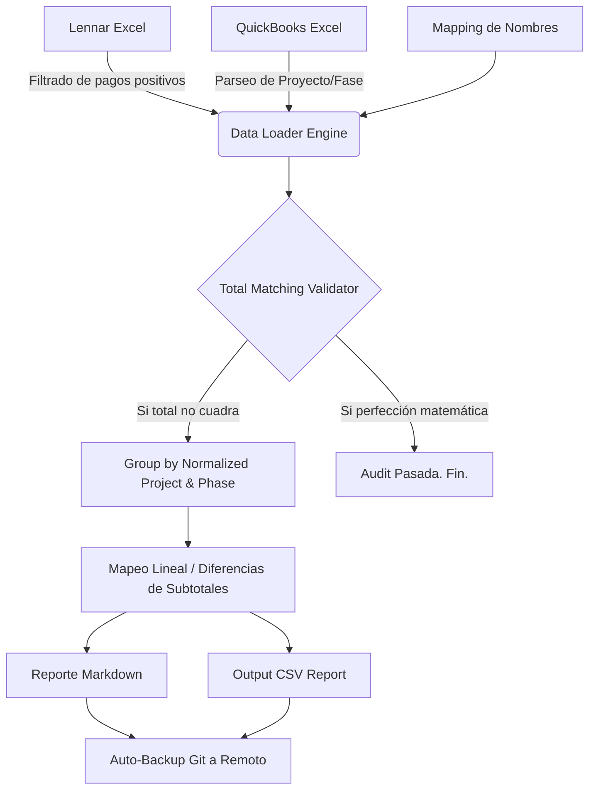

# Lennar-QB Reconciler 📊

Un poderoso motor de auditoría automatizada en Python para identificar discrepancias al centavo entre la fuente de verdad (Lennar) y el control interno de QuickBooks. 

Esta herramienta multiplataforma asegura el rastreo y validación matemática de pagos recibidos contra registros ingresados agrupando por Proyecto y Fase de obra.

## 🚀 Arquitectura y Workflow

El proceso de reconciliación ocurre en varias fases:



## 🛠 Instalación y Configuración

El proyecto está diseñado para funcionar nativamente tanto en Windows como en macOS garantizando integridad de rutas mediante `pathlib`.

1. Clona el repositorio a tu máquina local.
2. Crea el entorno virtual (opcional pero recomendado):
   ```bash
   python -m venv venv
   source venv/bin/activate  # MacOS
   # venv\Scripts\activate   # Windows
   ```
3. Instala los paquetes requeridos desde `requirements.txt`:
   ```bash
   pip install -r requirements.txt
   ```

## 💻 Uso de la Aplicación

Para lanzar la auditoría, simplemente ejecuta el módulo principal `reconciler`:

```bash
python src/reconciler.py
```

### Resultados y Log de Fallos
La aplicación validará matemáticamente todos los registros y en caso de identificar discrepancias se detendrá y generará reportes profesionales en la carpeta `/output`. El reporte final de CSV contiene:
- `Proyecto` / `Fase`
- `Monto Lennar` y `Monto QB`
- `Diferencias Matemáticas`
- `Acción Correctiva Exacta` sugerida en QuickBooks (ej. Ajuste de Memos).

### 🔒 Política de Prevención e Integración Continua (Git)
Se ha implementado un `.gitignore` estricto que protege preventivamente cualquier archivo nativo proveniente de finanzas en `/data`. 
La utilería `/utils/git_helper.py` cuenta con funciones integradas para auto-commitear **únicamente los logs de fallos generados en CSV/MD** hacia Github al finalizar un procesamiento.
